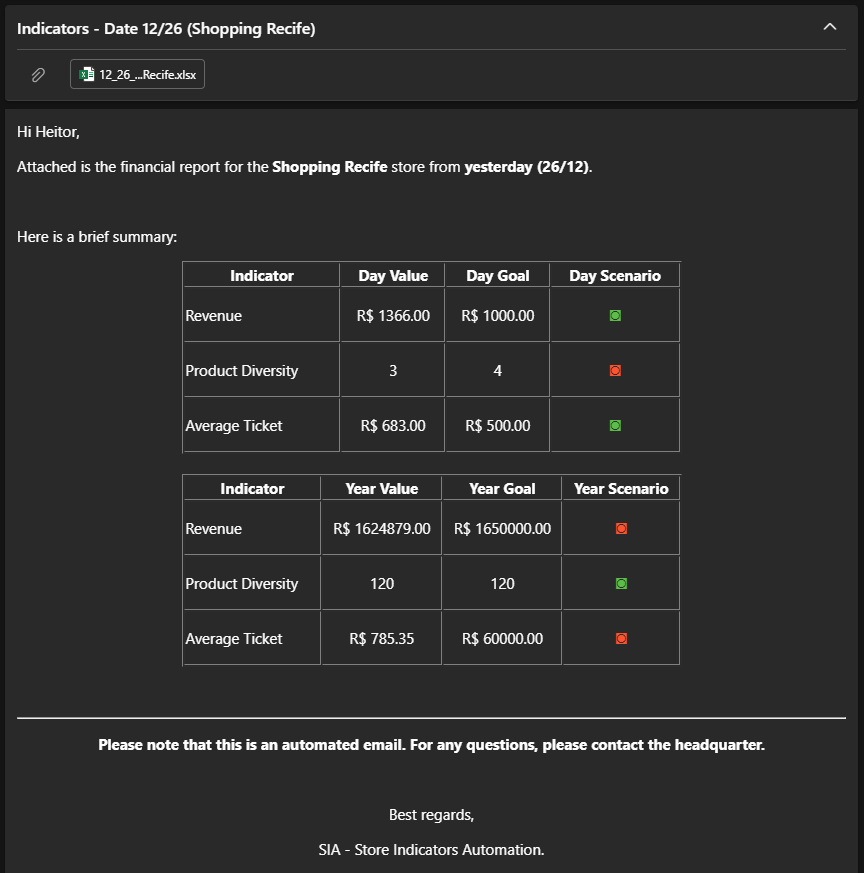
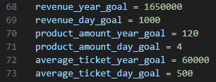

# Store Indicators Automation (SIA)

## Introduction

This script automates the process of analyzing sales data, generating reports, and sending emails to store managers and the company director. It utilizes Python libraries like Pandas and Win32com to perform data manipulation, email creation, and sending.

## Requirements

- Python 3.x
| Library | Version | Install                   |
|---------|---------|---------------------------|
| pandas  | 2.2.3   | ```pip install pandas```  |
| pywin32 | 306     | ```pip install pywin32``` |
| pathlib | 1.0.1   | ```pip install pathlib``` |

## Instructions

- Install the required libraries with ```pip install pandas pathlib pywin32```.
- Replace the file paths in the script with the actual locations of your data files (Databases/emails.xlsx, Databases/stores.csv, and Databases/sales.xlsx).
- Make sure you have Microsoft Outlook configured on your system.
- Run the script ```python main.py```).

## Structure
The script is divided into eight main steps:

1. Import Libraries: Imports necessary libraries like Pandas, pathlib, and Win32com.
2. Load Data: Reads sales data from Excel and CSV files, handling potential encoding issues.
3. Prepare Data: Merges sales data with store information and identifies the latest day with available data.
4. Save Backup Reports: Creates backup folders for each store and saves daily sales reports.
5. Calculate Indicators: Calculates revenue, product diversity, and average ticket for each store, both daily and annually.
6. Send Email to Store Managers: Creates and sends an email with performance indicators and a report attachment to each store manager.
7. Create Rankings: Generates rankings for annual and daily sales performance across all stores and saves them as Excel files.
8. Send Email to Director: Sends an email with ranking information and attachments to the company director.

## Additional Notes

This script uses HTML formatting for emails. You can customize the email content and design within the HTML body section.



The script defines goals for each indicator. You can adjust these values based on your specific needs.



## Contact

For any questions or support, please contact me in abithedev@gmail.com.

## 🚀 About me
Hi! My name is Abimael, but you can call me Abi! 👋

I am a Full Stack Developer. I initially started studying Python and solving countless challenges proposed to me while working as a freelance developer at DM Easy Dev. & Tec.

Today I am also studying Java, Dart, JavaScript and preparing to start my postgraduate degree in Software Architecture.
#### 🔗 Links


**[](https://www.linkedin.com/in/abimael-nunes/)**
**[](https://www.instagram.com/abi_nunes/)**
#### 🛠 Habilidades
Python, Dart, Java, JavaScript,  HTML, CSS.

